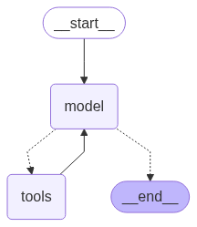

# SmartChat Server

## Environment variables

- LANGSMITH_TRACING=true - enabling LANGSMITH tracing
- LANGSMITH_ENDPOINT="https://api.smith.langchain.com"
- LANGSMITH_PROJECT="pr-smart-chat" - project name in LANGSMITH
- LANGSMITH_API_KEY="put_your_LANGSMITH_API_KEY_here"
- OPENAI_API_KEY = "put_your_OPENAI_API_KEY_here"
- TAVILY_API_KEY = "put_your_TAVILY_API_KEY_here"

## Running server app locally

- make sure all the environment variables from `.env` are avaiable and have valid values

- make sure you are in the `server` directory. If not go into it:

`cd server`

- activate virtual environment:

`.\.venv\Scripts\activate` (windows)

- install all the dependencies:

`pip install -r .\requirements.txt`

- run the project:

`uvicorn app:app --host=0.0.0.0 --port=8000`
